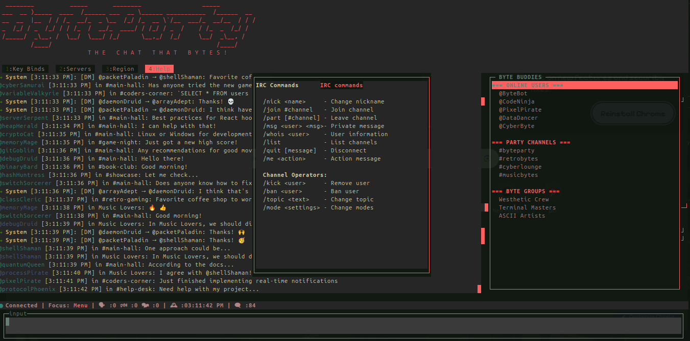

# ByteParty: Terminal-Based IRC Chat Application


## Project Vision

ByteParty is a **full-featured, terminal-based chat application** designed to bring the classic IRC (Internet Relay Chat) experience into the modern terminal with enhanced UI/UX. The final product will be a **cross-platform, keyboard-first chat client** that supports multiple IRC networks, features rich text formatting, user management, and a responsive terminal interface with intuitive keyboard navigation.

**Final Project Goals:**
- Complete IRC protocol implementation with support for multiple servers
- Encrypted communication channels
- Plugin system for extensibility
- Theme customization and UI theming
- Cross-platform support (Linux, macOS, Windows terminals)
- Mobile terminal compatibility
- Chat logging and search capabilities
- File transfer capabilities
- Bot integration framework
- Screen/tmux session persistence

## Table of Contents
- [Features](#-features)
- [Getting Started](#-getting-started)
- [Architecture](#-architecture)
- [Development Setup](#-development-setup)
- [Collaboration Guidelines](#-collaboration-guidelines)
- [Keyboard Shortcuts](#-keyboard-shortcuts)
- [IRC Documentation](#-irc-documentation)
- [Contributing](#-contributing)
- [License](#-license)

## Features

### Current Implementation
- **Terminal UI Framework**: Built with Blessed.js for rich terminal interfaces
- **Responsive Layout**: Dynamic window resizing and component positioning
- **Keyboard-First Navigation**: Extensive keyboard shortcuts for all operations
- **Focus Management**: Tab-based navigation between UI components
- **Modal System**: Contextual modals for help, settings, and user actions
- **Typewriter Effects**: Animated boot sequence with fading transitions
- **User Management**: Online user listing with contextual dropdown menus
- **Message Handling**: Smart message wrapping and formatting
- **Status Bar**: Real-time connection status and activity indicators

### Planned Features
- **IRC Protocol Support**: Full IRC client implementation
- **Multiple Server Connections**: Connect to multiple IRC networks simultaneously
- **Encryption**: End-to-end encrypted private messages
- **Theme System**: Customizable color schemes and layouts
- **Plugin Architecture**: Extensible via JavaScript/TypeScript plugins
- **Chat Logging**: Persistent message history with search
- **File Sharing**: Encrypted file transfer capabilities
- **Mobile Support**: Optimized for mobile terminal apps
- **Bot Framework**: Easy bot creation and integration

##  Getting Started

### Prerequisites
- Node.js 16.x or higher
- npm or yarn package manager
- TypeScript 4.x or higher
- Terminal with 256-color support (recommended)

### Installation

1. **Clone the repository:**
   ```bash
   git clone https://github.com/humangp/byteparty.git
   cd byteparty
   ```

2. **Install dependencies:**
   ```bash
   npm install
   # or
   yarn install
   ```

### Development Mode
For active development using TypeScript directly:
```bash
npm run dev
```
# Runs app.ts directly with ts-node (no compilation needed)


## 🏗 Architecture

### Project Structure
```
byteparty/
├── src/
│   ├── components/
│   │   ├── UI/
│   │   │   ├── APP_UI.ts          # Main UI controller
│   │   │   └── ui.ts              # UI configuration
│   │   ├── lib/
│   │   │   └── test.ts            # Demo simulator
│   │   └── configs.ts             # Configuration objects
│   ├── core/
│   │   ├── irc/
│   │   │   ├── client.ts          # IRC client implementation
│   │   │   ├── protocol.ts        # IRC protocol parser
│   │   │   └── commands.ts        # IRC command handlers
│   │   └── encryption/            # Encryption module
│   ├── plugins/                   # Plugin system
│   ├── themes/                    # UI themes
│   └── utils/                     # Utility functions
├── assets/
│   ├── byteparty-demo.gif         # Demo animation
│   └── IRC1459.pdf               # IRC specification
├── app.ts                         # Application entry point
├── package.json
├── tsconfig.json
└── README.md
```

### Key Components
1. **APP_UI**: Main UI controller managing all terminal elements
2. **ByteParty**: Application orchestrator
3. **DemoSimulator**: Chat simulation for testing
4. **Configuration Objects**: UI styling and layout definitions

### Technology Stack
- **TypeScript**: Primary development language
- **Blessed.js**: Terminal interface library
- **Node.js**: Runtime environment
- **IRC Protocol**: Chat communication protocol

## 👥 Collaboration Guidelines

### Development Workflow

1. **Fork & Clone**
   ```bash
   # Fork the repository on GitHub
   # Clone your fork locally
   git clone https://github.com/humangp/byteparty.git
   cd byteparty
   git remote add upstream https://github.com/original-owner/byteparty.git
   ```

2. **Branch Naming Convention**
   ```
   feature/description    # New features
   bugfix/description     # Bug fixes
   refactor/description   # Code refactoring
   docs/description       # Documentation updates
   test/description       # Test additions
   ```

3. **Commit Guidelines**
   - Use conventional commit messages
   - Keep commits focused and atomic
   - Reference issue numbers when applicable

4. **Pull Request Process**
   - Create a PR from your feature branch to `main`
   - Ensure all tests pass
   - Update documentation as needed
   - Request review from maintainers

### Code Standards

1. **TypeScript**
   - Use strict TypeScript configuration
   - Define interfaces for all data structures
   - Use async/await over callbacks where possible

2. **Code Style**
   - 2-space indentation
   - CamelCase for variables and functions
   - PascalCase for classes and interfaces
   - Descriptive variable names

3. **Documentation**
   - JSDoc comments for public APIs
   - Inline comments for complex logic
   - Update README for user-facing changes

### Testing
```bash
# Run tests
npm test

# Run tests with coverage
npm run test:coverage

# Run linting
npm run lint

# Run type checking
npm run type-check
```

## ⌨️ Keyboard Shortcuts

### Global Shortcuts (Work Everywhere)
| Key | Action | Description |
|-----|--------|-------------|
| `Tab` | Next Element | Move focus to next UI element |
| `Shift+Tab` | Previous Element | Move focus to previous UI element |
| `Ctrl+I` | Focus Input Box | Jump directly to message input |
| `Ctrl+M` | Focus Message List | Jump to message history |
| `Ctrl+U` | Focus User List | Jump to online users list |
| `Ctrl+B` | Focus Menu Bar | Jump to main menu |
| `F1` | Show Help | Display keyboard shortcuts |
| `F2` | Throw Confetti | Celebration animation |
| `F3` | Show Stats | Display connection statistics |
| `F5` | Refresh Interface | Reload UI components |
| `Ctrl+L` | Clear Chat | Clear message history |
| `:` | Command Mode | Open command palette |
| `/` | Search | Focus input with search prefix |
| `Ctrl+Q` | Quit Application | Exit ByteParty |
| `Ctrl+H` | Toggle User List | Show/hide user panel |
| `Ctrl+J` | Toggle Menu Bar | Show/hide menu bar |
| `Ctrl+P` | Screenshot | Capture terminal state (debug) |
| `Esc` | Escape/Cancel | Close modals or return to input |

### Input Box Shortcuts
| Key | Action | Description |
|-----|--------|-------------|
| `↑` | Command History Up | Navigate previous commands |
| `↓` | Command History Down | Navigate next commands |
| `Ctrl+Enter` | Send Message | Alternative send key |
| `Ctrl+U` | Clear Input | Remove all text from input |
| `@` | Mention Autocomplete | Show user mention suggestions |
| `#` | Channel Autocomplete | Show channel suggestions |
| `Ctrl+A` | Beginning of Line | Move cursor to line start |
| `Ctrl+E` | End of Line | Move cursor to line end |
| `Alt+B` | Back One Word | Move cursor back one word |
| `Alt+F` | Forward One Word | Move cursor forward one word |

### Message List Shortcuts
| Key | Action | Description |
|-----|--------|-------------|
| `PageUp` | Scroll Up | Scroll message list up |
| `PageDown` | Scroll Down | Scroll message list down |
| `Home` | Top of List | Jump to first message |
| `End` | Bottom of List | Jump to last message |
| `/` | Search Messages | Open message search |
| `N` | Find Next | Find next search match |
| `Shift+N` | Find Previous | Find previous search match |
| `Ctrl+C` | Copy Message | Copy selected message |
| `R` | Reply to Message | Quote selected message |
| `M` | Mark as Read | Toggle message read status |

### User List Shortcuts
| Key | Action | Description |
|-----|--------|-------------|
| `Enter` | Select User | Open user context menu |
| `Space` | Quick Menu | Show user actions |
| `M` | Message User | Start private chat |
| `I` | Invite User | Invite to current channel |
| `V` | View Profile | Display user information |
| `B` | Block User | Block selected user |
| `/` | Filter Users | Search user list |
| `F` | Toggle Filter | Enable/disable user filtering |
| `G` | Toggle Grouping | Group users by status |

### Menu Navigation
| Key | Action | Description |
|-----|--------|-------------|
| `←` or `L` | Menu Left | Select previous menu item |
| `→` or `H` | Menu Right | Select next menu item |
| `Enter` | Activate Menu | Execute selected menu action |
| `1` | Menu Item 1 | Jump to "Key Binds" menu |
| `2` | Menu Item 2 | Jump to "Servers" menu |
| `3` | Menu Item 3 | Jump to "Region" menu |
| `4` | Menu Item 4 | Jump to "Help" menu |

## 📚 IRC Documentation

ByteParty implements the Internet Relay Chat protocol, a real-time Internet text messaging system. For detailed protocol specifications:

### Official Documentation
- **RFC 1459**: [IRC Protocol Specification](./assets/IRC1459.pdf)
- **RFC 2810-2813**: Updated IRC specifications
- **Modern IRC Extensions**: SASL authentication, TLS encryption

### IRC Commands Supported
```irc
/help                    - Show help information
/nick <name>             - Change your nickname
/join #channel           - Join a channel
/part [#channel]         - Leave a channel
/msg <user> <message>    - Send private message
/whois <user>            - Get user information
/list                    - List available channels
/quit [message]          - Disconnect from server
```

### Server Connections
ByteParty supports connections to popular IRC networks:
- **Libera.Chat**: irc.libera.chat:6697 (TLS)
- **Freenode**: irc.freenode.net:6667
- **IRCNet**: irc.ircnet.com:6667
- **EFNet**: irc.efnet.org:6667
- **QuakeNet**: irc.quakenet.org:6667

## 🤝 Contributing

We welcome contributions from the community! Here's how you can help:

### Areas Needing Contribution
1. **IRC Protocol Implementation**
   - Complete IRC command parsing
   - Server connection management
   - Channel and user state tracking

2. **UI Enhancements**
   - Additional themes and color schemes
   - Improved layout responsiveness
   - Accessibility improvements

3. **Features**
   - Encryption implementation
   - File transfer protocol
   - Plugin system development
   - Mobile terminal optimization

4. **Documentation**
   - User guides and tutorials
   - API documentation
   - Translation/localization

### Getting Help
- **Issue Tracker**: Report bugs or request features
- **Discussion Forum**: Design discussions and Q&A
- **Chat Channel**: Real-time developer communication

## 📄 License

ByteParty is released under the MIT License. See LICENSE file for details.

## 🔗 Resources

- **Blessed.js Documentation**: [https://github.com/chjj/blessed](https://github.com/chjj/blessed)
- **IRC Protocol Specification**: [RFC 1459](./assets/IRC1459.pdf)
- **TypeScript Documentation**: [https://www.typescriptlang.org/docs/](https://www.typescriptlang.org/docs/)
- **Node.js Documentation**: [https://nodejs.org/docs/](https://nodejs.org/docs/)

---

**Happy Chatting!** If you have questions or need assistance, please open an issue or join our development chat.
